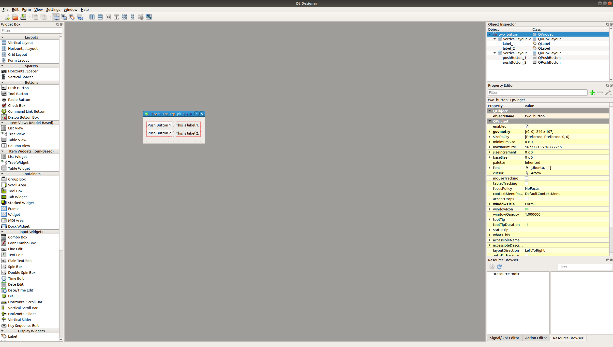

# ROS RQt Plugin

This repository demonstrates the usage of using ROS rqt plugin to design personal UI interface with both cpp and python.


At the moment only cpp version is updated. Python version will be updated on another branch soon.  

## Content
- [Content](#Content)
- [Package Creation](#Package-Creation)
  - [Dependencies](#Dependencies)
  - [Package Folder Structure](#Package-Folder-Structure)
- [UI File](#UI-File)
- [CMakeLists.txt](#CMakeListstxt)
- [package.xml](#packagexml)
- [plugin.xml](#pluginxml)
- [script/ros_rqt_plugin](#script/ros_rqt_plugin)
- [Recompile](#Recompile)
- [Include Path for Vscode](#Include-Path-for-Vscode)
- [Reference](#Reference)

## Steps

Note that plugin.xml class name should be unique in order for ROS to find it. Or else only the first one that registered is found.  

1. Create Package
1. Create Necessary Folders and Files
1. Create UI file with Qt Designer
1. Create setup.py
1. Create scripts/ros_rqt_plugin (python file)
1. Update package.xml (remember the export tag)
1. Update CMakeFile.txt
1. Compile (catkin_make)
1. Create and update include/ros_rqt_plugin/ros_rqt_plugin.hpp
1. Create and update src/ros_rqt_plugin/ros_rqt_plugin.cpp
1. Compile (catkin_make)
1. Create launch file (start.launch)

## Package Creation

Create your personal ROS RQt plugin with the following command:
```bash
catkin_create_pkg ros_rqt_plugin roscpp rospy rqt_gui rqt_gui_cpp rqt_gui_py std_msgs 
```
### Dependencies

To create a RQt plugin these are the dependencies that you actually need, the other dependencies included along with the catkin_create_pkg is for this demonstration purpose.  
```bash
roscpp
rospy
rqt_gui
rqt_gui_cpp
rqt_gui_py
```

### Package Folder Structure
```bash
ros_rqt_plugin
├── CMakeLists.txt
├── package.xml
├── plugin.xml
├── setup.py
├── launch
│   └── start.launch
├── resource
│   └── ros_rqt_plugin.ui
├── scripts
│   └── ros_rqt_plugin    # Remember to make it executable (chmod a+x ros_rqt_plugin)
├── include
│   └── ros_rqt_plugin
│       └── ros_rqt_plugin.hpp
└── src
    └── ros_rqt_plugin
            ├── ros_rqt_plugin.cpp
            └── ros_rqt_plugin.ui
```
## UI File

Create your ui file with `Qt 5 Designer`.
For more information, please look at this [video](https://www.youtube.com/watch?v=2mIyZX6x-S0).


## CMakeLists.txt

For the convienience of different Qt version, I have followed the exampl from [rqt_template_plugin](https://github.com/marco-tranzatto/rqt_template_plugin).

```cmake
cmake_minimum_required(VERSION 3.0.2)
project(ros_rqt_plugin)

## Compile as C++11, supported in ROS Kinetic and newer
set(CMAKE_CXX_STANDARD 11)
set(CMAKE_CXX_STANDARD_REQUIRED ON)

find_package(catkin REQUIRED COMPONENTS
  geometry_msgs
  roscpp
  rospy
  std_msgs
  rqt_gui
  rqt_gui_cpp
  rqt_gui_py
)

# Find qt package
if ("${qt_gui_cpp_USE_QT_MAJOR_VERSION} " STREQUAL "5 ")
    find_package(Qt5Widgets REQUIRED)
else ()
    find_package(Qt4 COMPONENTS QtCore QtGui REQUIRED)
    include(${QT_USE_FILE})
endif ()

## Uncomment this if the package has a setup.py. This macro ensures
## modules and global scripts declared therein get installed
## See http://ros.org/doc/api/catkin/html/user_guide/setup_dot_py.html
catkin_python_setup()

# Define source file
set(${PROJECT_NAME}_SRCS
  src/${PROJECT_NAME}/ros_rqt_plugin.cpp
)

# Define header file
set(${PROJECT_NAME}_HDRS
  include/${PROJECT_NAME}/ros_rqt_plugin.hpp
)

# Define ui file
set(${PROJECT_NAME}_UIS
  resource/ros_rqt_plugin.ui
)

# Define include directory
set(${PROJECT_NAME}_INCLUDE_DIRECTORIES
  include
  ${CMAKE_CURRENT_BINARY_DIR}
)

catkin_package(
   INCLUDE_DIRS include
   LIBRARIES ${PROJECT_NAME}
   CATKIN_DEPENDS geometry_msgs roscpp rospy std_msgs rqt_gui rqt_gui_cpp rqt_gui_py
   DEPENDS #system_lib
)

# Obtain qt wrap cpp and qt wrap ui
if ("${qt_gui_cpp_USE_QT_MAJOR_VERSION} " STREQUAL "5 ")
    qt5_wrap_cpp(${PROJECT_NAME}_MOCS ${${PROJECT_NAME}_HDRS})
    qt5_wrap_ui(${PROJECT_NAME}_UIS_H ${${PROJECT_NAME}_UIS})
else ()
    qt4_wrap_cpp(${PROJECT_NAME}_MOCS ${${PROJECT_NAME}_HDRS})
    qt4_wrap_ui(${PROJECT_NAME}_UIS_H ${${PROJECT_NAME}_UIS})
endif ()

include_directories(
    ${${PROJECT_NAME}_INCLUDE_DIRECTORIES}
    ${catkin_INCLUDE_DIRS}
)

add_library(${PROJECT_NAME}
    ${${PROJECT_NAME}_SRCS}
    ${${PROJECT_NAME}_MOCS}
    ${${PROJECT_NAME}_UIS_H}
)

target_link_libraries(${PROJECT_NAME}
    ${catkin_LIBRARIES}
)

if ("${qt_gui_cpp_USE_QT_MAJOR_VERSION} " STREQUAL "5 ")
    target_link_libraries(${PROJECT_NAME} Qt5::Widgets)
else ()
    target_link_libraries(${PROJECT_NAME} ${QT_QTCORE_LIBRARY} ${QT_QTGUI_LIBRARY})
endif ()

# Find class loader
# For more information please visit: http://wiki.ros.org/class_loader
find_package(class_loader)
class_loader_hide_library_symbols(${PROJECT_NAME})

# Install plugin path
install(FILES plugin.xml
  DESTINATION ${CATKIN_PACKAGE_SHARE_DESTINATION}
)

install(TARGETS ${PROJECT_NAME}
  ARCHIVE DESTINATION ${CATKIN_PACKAGE_LIB_DESTINATION}
  LIBRARY DESTINATION ${CATKIN_PACKAGE_LIB_DESTINATION}
  RUNTIME DESTINATION ${CATKIN_GLOBAL_BIN_DESTINATION}
)

catkin_install_python(PROGRAMS scripts/${PROJECT_NAME}
  DESTINATION ${CATKIN_PACKAGE_BIN_DESTINATION}
)

install(DIRECTORY include/${PROJECT_NAME}/
  DESTINATION ${CATKIN_PACKAGE_INCLUDE_DESTINATION}
)
```

## package.xml

Do not forget to add export tag correctly.  
```xml
<?xml version="1.0"?>
<package format="2">
  <name>ros_rqt_plugin</name>
  <version>0.0.0</version>
  <description>The ros_rqt_plugin package</description>

  <maintainer email="jianle001@e.ntu.edu.sg">Bruce Chan Jian Le</maintainer>
  <license>BSD</license>
  <url type="website">https://github.com/BruceChanJianLe/ros-rqt-plugin</url>
  <author email="jianle001@e.ntu.edu.sg">Bruce Chan Jian Le</author>


  <buildtool_depend>catkin</buildtool_depend>
  <build_depend>roscpp</build_depend>
  <build_depend>rospy</build_depend>
  <build_depend>rqt_gui</build_depend>
  <build_depend>rqt_gui_cpp</build_depend>
  <build_depend>rqt_gui_py</build_depend>
  <build_depend>std_msgs</build_depend>

  <build_export_depend>roscpp</build_export_depend>
  <build_export_depend>rospy</build_export_depend>
  <build_export_depend>rqt_gui</build_export_depend>
  <build_export_depend>rqt_gui_cpp</build_export_depend>
  <build_export_depend>rqt_gui_py</build_export_depend>
  <build_export_depend>std_msgs</build_export_depend>

  <exec_depend>roscpp</exec_depend>
  <exec_depend>rospy</exec_depend>
  <exec_depend>rqt_gui</exec_depend>
  <exec_depend>rqt_gui_cpp</exec_depend>
  <exec_depend>rqt_gui_py</exec_depend>
  <exec_depend>std_msgs</exec_depend>


  <export>
    <rqt_gui plugin="${prefix}/plugin.xml"/>
  </export>
</package>
```

## plugin.xml

Note that the class name must be unique, else ROS would be able to find it.  

```xml
<library path="lib/libros_rqt_plugin">
    <!-- Note that the class name must be unique, else ROS would be able to find it -->
    <!-- The class name also need to follow the "namespace/class_name" convention in order to work properly -->
    <class name="ros_rqt_plugin/two_button_plugin" type="ros_rqt_plugin::two_button_plugin" base_class_type="rqt_gui_cpp::Plugin">
        <description>
            This is an example of two push buttons.
        </description>
        <qtgui>
        <group>
            <label>Topics</label>
            <icon type="theme">folder</icon>
            <statustip></statustip>
        </group>
        <label>Two Push Example Buttons</label>
        <icon type="theme">applications-graphics</icon>
        <statustip>This is an example of two push buttons.</statustip>
        </qtgui>
    </class>
</library>
```

**Explanation**:  
```md
- library@path: The package-relative path which gets added to sys.path. 

- library/class@name: The name of the plugin, which must be unique within a package. 

- library/class@type: The concatenated name of the package, module and class, which is used for the import statement. (Form: package.module.class) 

- library/class@base_class_type: For Python plugins which use the rospy client library the value is rqt_gui_py::Plugin. 

- library/description: The description of the plugin. 

- library/qtgui: This tag contains additional optional information about the package. If none are provided, the name of the plugin is used as the label for the plugin in the menu and the description is displayed as a status tip.

    - library/qtgui/group (optional, multiple): Enables grouping of plugins. Group tags can contain a label, icon and statustip tag. The groups form a hierarchy of menus where the plugin is added as the leaf. The groups of different plugins are merged based on their label (icons and statustip may be overridden by other plugins when they are defined differently). 

    - library/qtgui/label: Overrides the label with which the plugin appears in the menu. 

    - library/qtgui/icon: Defines the icon that should be shown beside the label (depending on the type of attribute). 

    - library/qtgui/icon@type: 

        - file (default): the icon value is a package-relative path to an image.

        - theme: the icon value names an icon defined by the Icon Naming Specification.

        - resource: the icon value names a Qt resource. 

    - library/qtgui/statustip: Overrides the status tip that is shown when hovering over the plugin label. 
```

## script/ros_rqt_plugin

This script directory stores a python script that will launch the rqt package.  
Please follow the naming convention in order for the package to work properly.  

```python
#!/usr/bin/env python

import sys

from rqt_gui.main import Main


main = Main()
sys.exit(main.main(
    sys.argv,
    # Note to follow the this structure to launch correctly
    # 'namespace/class_name'
    standalone='ros_rqt_plugin/two_button_plugin'
))
```

## Recompile

This section inform user when to recompile thier when there's changes.  

When changes happen to the following files, please run `catkin_make` again.

1. plugin.xml
1. scripts/ros_rqt_plugin
1. include/ros_rqt_plugin/ros_rqt_plugin.hpp
1. src/ros_rqt_plugin/ros_rqt_plugin.cpp

## Include Path for Vscode

To obtain the header for `#include <ros_rqt_plugin/ui_ros_rqt_plugin.h>` please include the build folder.  
```json
{
    "configurations": [
        {
            "browse": {
                "databaseFilename": "",
                "limitSymbolsToIncludedHeaders": true
            },
            "includePath": [
                "/usr/include/**",
                "${workspaceFolder}/include/**",
                "${workspaceFolder}/../../build/**"
            ],
            "name": "ROS",
            "compilerPath": "/usr/bin/gcc",
            "cStandard": "c11",
            "cppStandard": "c++14",
            "intelliSenseMode": "gcc-x64"
        }
    ],
    "version": 4
```

## Reference

- Video lesson on UI file. [link](https://www.youtube.com/watch?v=2mIyZX6x-S0)
- main reference for package. [link](https://github.com/marco-tranzatto/rqt_template_plugin)
- updated rqt_image_viewer. [link](https://github.com/ros-visualization/rqt_image_view)
- older rqt_image_viewer. [link](https://github.com/ros-visualization/rqt_common_plugins/tree/619481f13084db01c7e2233b754bb0409ce1c44a/rqt_image_view)
- rqt plugin examples. [link](http://wiki.ros.org/rqt/Plugins)
- reference to other people github tutorial if you are so incline. [link1](https://github.com/how-chen/rqt_mypkg) [link2](https://github.com/leggedrobotics/catkin_create_rqt)